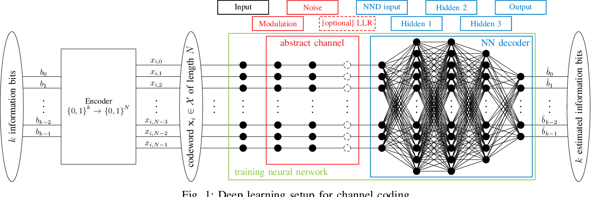

# On-Deep-Learning-Based-Channel-Decoding
Tensorflow implementation of the paper ["On Deep Learning-Based Channel Decoding"](http://arxiv.org/abs/1701.07738)

This repository provides the complete code for the Keras (TensorFlow 2.2.0) implementation of the above paper with a brief report of the results and observations.

Google Colaboratory link is also provided for instantly start running the script!

The topics covered are:

- Implementation of a NND, Neural Network Decoder with custom layers ( BPSK Modulation and AWGN channel in the neural network model itself as proposed in the paper)
- Finding the optimal training SNR
- Experimental Investigation when the NND is trained at multiple SNR values**
- How many epochs for the NND to converge?
- Best Neural Netowrk architecture
- Capability of generalization
